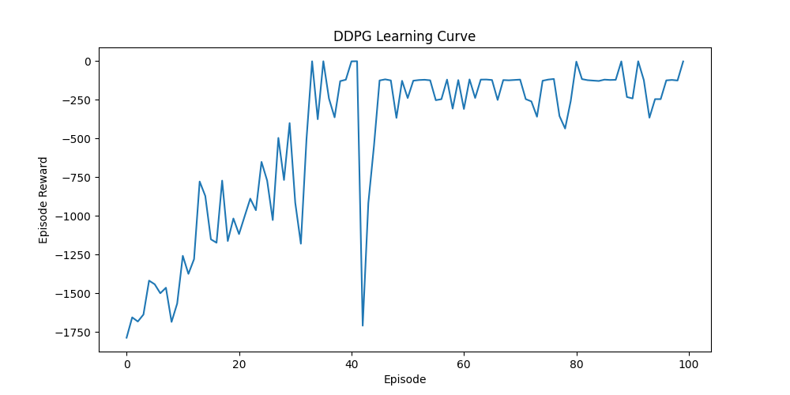

# Deep Deterministic Policy Gradient (DDPG) Implementation in PyTorch

This repository contains a PyTorch implementation of the **Deep Deterministic Policy Gradient (DDPG)** algorithm. DDPG is an actor-critic, model-free algorithm based on the deterministic policy gradient that can operate over continuous action spaces. This implementation was tested using the `Pendulum-v1` environment from OpenAI Gym.

---

## 🧠 What is DDPG?

DDPG is a reinforcement learning algorithm designed to work with environments where actions are continuous rather than discrete. It combines ideas from DQN and Actor-Critic methods, using:

- **Actor network** to determine the best action to take in a given state.
- **Critic network** to evaluate how good the action taken by the actor is.

It uses the following core components:

---

## ⚙️ Components of DDPG

### 1. **Actor-Critic Networks**
- **Actor**: Learns a policy function, outputs continuous actions.
- **Critic**: Evaluates the value (Q-value) of the actor's action.

### 2. **Target Networks**
- Separate target networks for both Actor and Critic to stabilize training.
- Slowly updated using soft updates from the main networks.

### 3. **Experience Replay**
- Transitions (state, action, reward, next_state) are stored in a replay buffer.
- Random sampling breaks the correlation between consecutive transitions.

### 4. **Exploration using Ornstein-Uhlenbeck (OU) Process**
- Helps in exploration by adding temporally correlated noise to actions.

---

## 🔄 Overview of the OU Process Implementation
The **Ornstein-Uhlenbeck process** generates noise with temporal correlation, which is especially useful in physical control problems where inertia plays a role.

## 📐 Network Architecture 
###  **Actor-Critic Networks**
The actor network takes in the current state and outputs a continuous action within the valid action range:

Input Layer: state_dim neurons
Hidden Layer 1: 256 neurons, ReLU activation
Hidden Layer 2: 256 neurons, ReLU activation
Hidden Layer 3: 256 neurons, ReLU activation
Output Layer: action_dim neurons, Tanh activation (to keep actions in range [-1, 1])
Scaling: The output is scaled by max_action

The critic network evaluates a given state-action pair and outputs a Q-value:

Input Layer: state_dim + action_dim neurons (concatenated input)
Hidden Layer 1: 256 neurons, ReLU activation
Hidden Layer 2: 256 neurons, ReLU activation
Hidden Layer 3: 256 neurons, ReLU activation
Output Layer: 1 neuron (Q-value prediction)

## ✅ Output

- Episode 10/100, Avg Reward: -1583.48
- Episode 20/100, Avg Reward: -1083.44
- Episode 30/100, Avg Reward: -808.28
- Episode 40/100, Avg Reward: -382.91
- Episode 50/100, Avg Reward: -403.68
- Episode 60/100, Avg Reward: -177.63
- Episode 70/100, Avg Reward: -164.24
- Episode 80/100, Avg Reward: -239.15
- Episode 90/100, Avg Reward: -109.04
- Episode 100/100, Avg Reward: -159.20

- Test Reward = -358.07

## 🔮 Future Scope
1. Improve the Neural Network
2. Add more OpenAI Gym environment and test them
